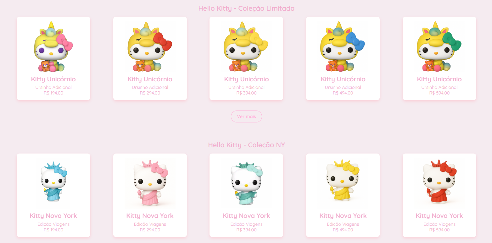
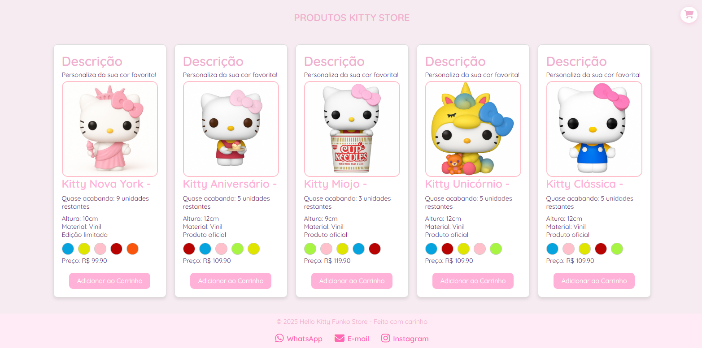

# Página de Desenvolvimento Web
# Criação de uma loja usando VUE

### 

# PÁGINA INICIAL

  

# PRODUTOS PÁGINA INICIAL 1

  

# PRODUTOS PÁGINA INICIAL 2

  

# PRODUTOS PÁGINA INICIAL 3 E FOOTER

  

# P

  

